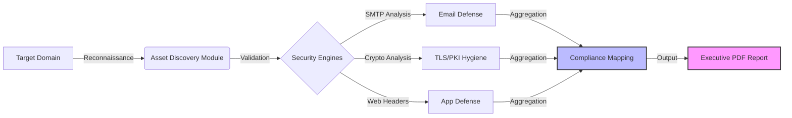

<p align="center">
  
  
  
</p>

# 🕵️ Legal Identity Audit Toolkit (L.I.A.T.)

**Sesecpro Compliance Engine v2.0 Enterprise**

Esta herramienta es el motor de reconocimiento automatizado utilizado por **Sesecpro** para realizar auditorías de "Caja Negra" (Blackbox Audits) sobre la identidad digital de una organización. 

Su propuesta de valor única es la **traducción de hallazgos técnicos en incumplimientos regulatorios**, permitiendo calcular el *Scoring de Riesgo Legal* de forma inmediata para el cumplimiento de normativas europeas.

---

## ⚙️ Arquitectura del Motor
El toolkit funciona como un pipeline de inteligencia que transforma datos brutos en métricas de gobernanza estratégica:



---

## 🚀 Capacidades del Motor (Capabilities)

| Módulo de Auditoría | Chequeo Técnico | Mapeo Normativo (Impacto) |
| :--- | :--- | :--- |
| **Identity & Brand Defense** | `SPF` / `DKIM` / `DMARC` / `BIMI` | **NIS2 Art. 21:** Prevención de suplantación y fraude al CEO (BEC). |
| **Attack Surface Recon** | `Subdomain Enum` + `CT Logs` | **DORA (ICT Risk):** Identificación de activos "Shadow IT". |
| **Crypto-Agility** | `TLS 1.2+` / `Weak Ciphers` / `HSTS` | **GDPR Art. 32:** Cifrado y protección de confidencialidad. |
| **Web Resilience** | `CSP` / `X-Frame` / `Permissions` | **OWASP Top 10:** Mitigación de inyecciones y Clickjacking. |
| **Scoring Algorithm** | Algoritmo Ponderado (0-100) | **KPI Ejecutivo:** Métrica única para el Board. |

---

## 🛠️ Quick Start (Installation)

Herramienta diseñada para analistas de seguridad y auditores GRC.

```bash
# 1. Clonar el repositorio
git clone [https://github.com/Sesecpro/legal-identity-audit-toolkit.git](https://github.com/Sesecpro/legal-identity-audit-toolkit.git)
cd legal-identity-audit-toolkit

# 2. Configurar entorno virtual
python -m venv venv
# Activar (Windows):
.\venv\Scripts\activate
# Activar (Linux/Mac):
source venv/bin/activate

# 3. Instalar dependencias
pip install -r requirements.txt

# 4. Ejecutar auditoría inicial
python main.py example.com --output report.json
```

## 💻 Usage Scenarios

### Auditoría Básica (JSON Output)
Ideal para integración con SIEM o dashboards de riesgos.
```bash
python main.py target.com --output audit_result.json
```

### Auditoría Ejecutiva (PDF Report)
Genera un informe visual listo para el Comité de Dirección con el mapeo de NIS2.
```bash
python main.py target.com --output target_report.json --pdf
```

### Modo Silencioso (Stealth Recon)
Optimiza la velocidad desactivando consultas a logs de transparencia pública.
```bash
python main.py target.com --no-ct --timeout 15
```

---

## 🧩 Estructura del Proyecto

Diseño modular para facilitar la extensión de nuevas normativas y reglas de negocio.

```text
├── main.py                   # Orquestador del análisis
├── core/                     # Motores Técnicos
│   ├── discovery.py          # OSINT & Recon (crt.sh, subdomains)
│   ├── email_security.py     # Análisis DNS (DMARC/SPF/MX)
│   ├── crypto.py             # Análisis de Cifrado (TLS/Ciphers)
│   └── http_security.py      # Seguridad de Aplicación (Headers)
├── compliance/               # Inteligencia Regulatoria
│   ├── rules.py              # Diccionario Hallazgo -> Artículo de Ley
│   └── scoring.py            # Motor de cálculo de riesgo ponderado
└── utils/                    # Exportadores
    ├── export.py             # Generador de JSON
    └── pdf_report.py         # Motor de renderizado PDF
```

## 📜 Compliance Standards Supported

* **NIS2 Directive (EU 2022/2555):** Artículos 20 (Gobernanza) y 21 (Gestión de Riesgos).
* **DORA Regulation (EU 2022/2554):** Resiliencia operativa para el sector financiero.
* **ISO/IEC 27001:2022:** Controles de seguridad de red y criptografía.

---

### ⚠️ License & Usage
**Proprietary Software.**
Este software es propiedad intelectual de **Sesecpro**. Se concede permiso de uso para fines educativos y de evaluación técnica. Queda prohibida su comercialización o distribución sin consentimiento expreso.

*© 2026 Sesecpro Engineering Team - Consultoría de Ciberseguridad Enterprise.*
